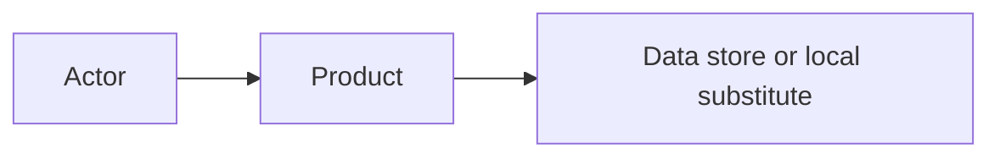

<!-- factory-template: remove this line after replacing every bracketed prompt. -->
# Architecture

## Context and constraints

- Product/profile: [name and profile]
- Requirement drivers: [FR/NFR/AC IDs]
- Workspace/runtime constraints: [constraints]
- Authority/deployment boundary: [local review-ready by default]

## Selected stack

| Component | Technology and exact version | Verification source/date | Rationale |
|---|---|---|---|
| [Runtime/framework/database/tool] | [Version] | [Installed metadata or primary docs] | [Why it fits] |

## System context and boundaries

- Trust boundaries: [boundaries]
- External dependencies: [dependencies and local substitutes]

## Modules and dependency direction

| Module | Responsibility | May depend on | Must not depend on |
|---|---|---|---|
| [Module] | [Responsibility] | [Allowed] | [Forbidden] |

## Delivery partitions and integration contracts

| Partition/slice | Owned files or modules | Stable contract/dependencies | Parallel-safe with | Integration order |
|---|---|---|---|---|
| SLICE-001 | [Exclusive ownership] | [Contract and prerequisite IDs] | [Non-overlapping slices] | [Order/barrier] |

## Data model, invariants, and lifecycle

- Entities and relationships: [model]
- Integrity/concurrency rules: [rules]
- Migrations and compatibility: [approach]
- Seed, backup/restore, and rollback: [approach]

## Contracts

- API/event/file/CLI contracts: [contracts]
- Boundary validation: [rules]
- Errors, idempotency, pagination, retries, and timeouts: [semantics]

## Security and privacy

- Assets and threats: [summary with RISK IDs]
- Authentication/session lifecycle: [design or N/A rationale]
- Authorization enforcement: [server-side boundaries]
- Secrets and configuration: [source and handling]
- Sensitive data/logging/retention: [controls]
- Abuse and negative tests: [planned tests]

## Reliability, performance, and operability

- Failure/degradation behavior: [behavior]
- Health, readiness, shutdown: [behavior]
- Logs, metrics, traces, diagnostics: [design]
- Performance/capacity budgets: [NFR IDs and budgets]

## UX and accessibility

- Supported interface matrix: [routes/platforms/viewports]
- Accessibility target and validation: [target]
- Loading, empty, error, offline, and permission states: [design]

## Test strategy

| Layer | Scope | Tools/fixtures | Gate |
|---|---|---|---|
| [Unit/integration/contract/E2E/security/etc.] | [Scope] | [Tools] | [When] |

## Deployment and rollback assumptions

- Build/package artifact: [artifact]
- Environments: [local/staging/production assumptions]
- Migration/rollback/feature flags: [approach]
- Release authorization required: [yes/no and who]

## Decisions

| ID | Decision | Rationale | Consequences | Detailed record |
|---|---|---|---|---|
| DEC-001 | [Decision] | [Reason] | [Tradeoff] | [.factory/decisions/DEC-001-slug.md or inline] |

## Architecture gate

- Independent reviewer: [agent/person and date]
- Artifact snapshot: [sha256 of reviewed architecture]
- Review batch/reports: [BATCH-### and .factory/reports paths]
- Decision: [pass/fail]
- Evidence: [report path]
- Unresolved material risk: [none or blocker]
